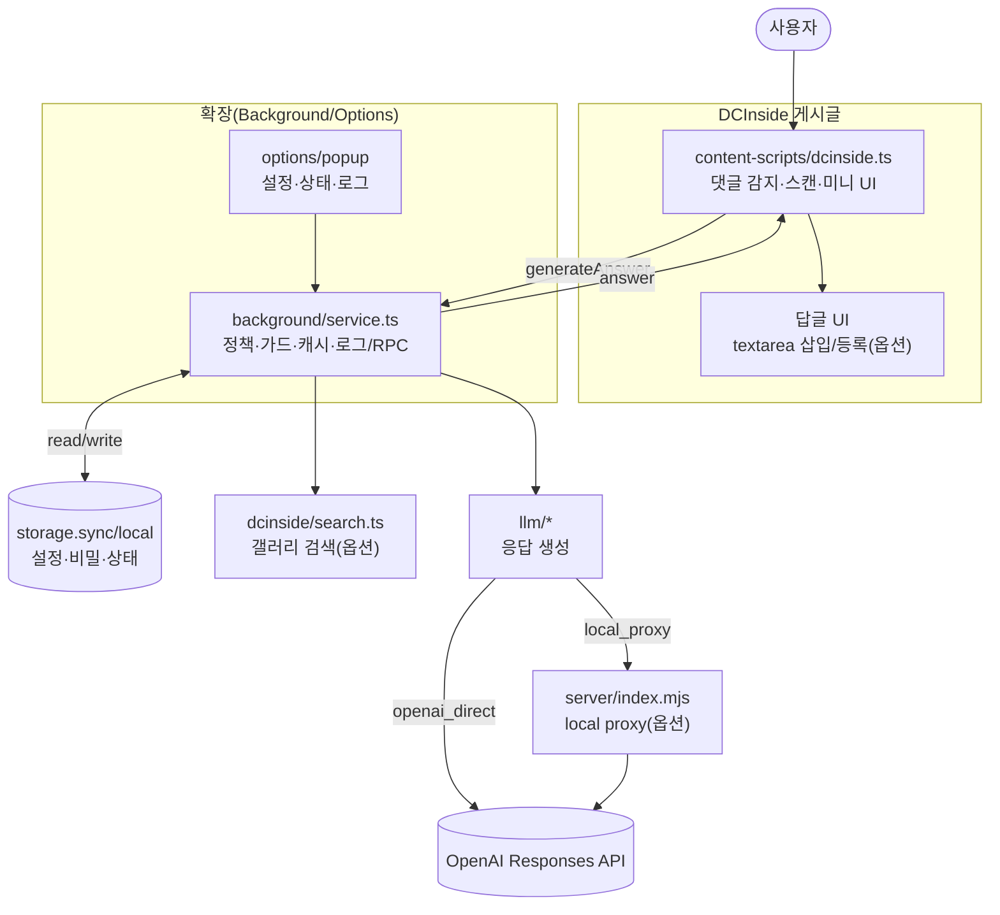
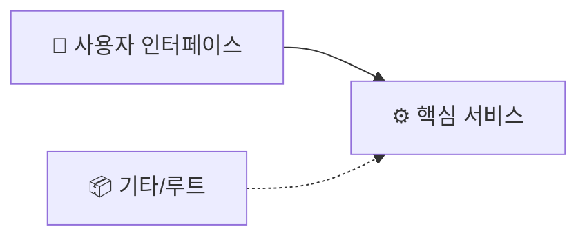

# 📊 프로젝트 종합 평가 보고서

> 이 문서는 Vibe Coding Report VS Code 확장에서 자동으로 관리됩니다.

---

## 📝 요약(한눈에)

<!-- AUTO-TLDR-START -->
| 항목 | 값 |
|------|-----|
| **전체 등급** | 🔵 B+ |
| **전체 점수** | 89/100 |
| **가장 큰 리스크** | 🟡 LLM 전송 컨텍스트(본문/최근 댓글)의 범위를 사용자가 세밀하게 제어하기 어려움(프라이버시/운영 정책 리스크) |
| **권장 최우선 작업** | `sec-privacy-context-controls-001`(컨텍스트 최소화/프라이버시 옵션 추가) |
<!-- AUTO-TLDR-END -->

---

## ⚠️ 리스크 요약

<!-- AUTO-RISK-SUMMARY-START -->
| 리스크 레벨 | 항목 | 관련 개선 ID |
|------------|------|-------------|
| 🟡 Medium | LLM 전송 컨텍스트(글 제목/본문, 최근 댓글)의 포함 여부/범위를 사용자가 명확히 제어하기 어려움(프라이버시·운영 정책 리스크) | `sec-privacy-context-controls-001` |
| 🟡 Medium | 서버 allowlist(`DCBOT_ALLOWED_ORIGINS`) 운영 시 확장 Origin 확인/복사 UX 부재로 설정 실수 가능 | `sec-proxy-allowlist-ux-001` |
| 🟢 Low | 처리된 댓글(handled) 상태를 옵션에서 초기화하는 UX 부재로 디버그/재시도 불편 | `feat-reset-handled-comments-001` |
| 🟢 Low | 답변 생성 시 최근 댓글 컨텍스트 추출이 전체 리스트 스캔 기반이라 대형 스레드에서 순간 CPU 부담 가능 | `opt-recent-comments-context-001` |
<!-- AUTO-RISK-SUMMARY-END -->

---

<!-- AUTO-OVERVIEW-START -->
## 📋 프로젝트 개요

### 🎯 목표와 비전
- **목적:** DCInside 게시글에서 트리거 댓글을 감지해 LLM 답변을 생성하고, 원 댓글의 하위댓글(답글) 입력창에 자동 삽입하여 작성 부담을 낮춤(기본: 자동 등록 OFF)
- **주요 목표:** (1) 사용자 통제(생성→삽입 2단계) 중심 자동화 (2) 비용 폭주 방지(동시/분당/쿨다운/캐시) (3) 보안 기본값 강화(로컬 프록시 토큰·Origin 정책, loopback 기본, `openai_direct` 키 저장 게이트) (4) 진단 가능성(중앙 로그·내보내기·프록시 셀프 테스트)
- **대상 사용자:** 특정 갤러리에서 질문/도움 응대가 잦은 개인 사용자(개인 배포/BYOK) 및 운영 보조 목적 사용자
- **주요 시나리오:** 트리거 포함 댓글 발견 → 답변 생성(미리보기) → [삽입]으로 textarea 입력 → 사용자가 최종 확인 후 등록(자동 등록은 옵션이며 캡차 감지 시 차단)
- **생태계 내 위치:** MV3 확장(Service Worker) 기반 경량 자동화 도구. 권장 경로는 `local_proxy`(키를 브라우저에 저장하지 않음)이며, `openai_direct`는 “브라우저 키 저장 허용”을 명시적으로 켠 경우에만 동작

### 🔄 실행 흐름(런타임) 다이어그램

### 📎 현재 구현 스펙(요약)
- **플랫폼:** Chrome Extension(MV3) / WXT + TypeScript + React(Options/Popup)
- **연동 모드:** `local_proxy`(기본/권장, 토큰 인증 + Origin 정책/allowlist) / `openai_direct`(브라우저 키 저장 “허용” 게이트)
- **안전 장치:** 2단계 UX(생성→삽입), autoSubmit 기본 OFF + “자동등록방지” 감지 시 자동 등록 차단, 동시/분당/쿨다운/캐시, 검색 타임아웃, 오류 로그(마스킹/중복 억제), dotenv 커밋 방지
- **컨텍스트:** 글 제목/본문 일부 + (선택) 최근 댓글 일부 + (선택) 갤러리 검색 결과(제목만 참고, URL은 답글에 첨부하지 않음)
- **저장소:** 설정 `storage.sync`, 민감값(API Key/프록시 토큰)·처리된 댓글·오류 로그 `storage.local`
- **성능/안정성:** 스캔 예산(시간/노드) + 점진 처리, MutationObserver 기반 증분 스캔, 숨김 탭 스킵, 장기 실행 Map 프루닝
- **품질 자동화:** 단위 테스트(Vitest) + CI(`compile/test/build`) 파이프라인

### 🔎 메타데이터

| 항목 | 값 |
|------|-----|
| **프로젝트명** | dcbot |
| **버전** | 0.0.0 |
| **최초 분석일** | 2025-12-29 |
| **최근 분석일** | 2025-12-29 |
| **파일 수(대략)** | 54 |
| **디렉토리 수(대략)** | 16 |
| **주요 언어** | TypeScript |
| **UI 프레임워크** | React |
<!-- AUTO-OVERVIEW-END -->

---

<!-- AUTO-STRUCTURE-START -->
## 📐 프로젝트 구조

### 📐 기능 기반 프로젝트 구조

**프로젝트**: `dcbot`
**타입**: ⚛️ React 앱

#### 기능 그룹 요약

| 그룹 | 대표 영역 | 파일 수 |
|:---|:---|:---:|
| 🧭 **사용자 인터페이스** | public | 6 |
| ⚙️ **핵심 서비스** | lib | 17 |
| 📦 **기타/루트** | 루트/기타 | 18 |

#### 대표 진입점
- _(엔트리포인트 자동 감지 실패)_

#### 구조 흐름

<!-- AUTO-STRUCTURE-END -->

---

<!-- AUTO-SCORE-START -->
## 📊 종합 점수 요약

### 📏 점수 ↔ 등급 매핑 규칙

| 점수 범위 | 등급 | 색상 | 의미 |
|:---:|:---:|:---:|:---:|
| 97–100 | A+ | 🟢 | 최우수 |
| 93–96 | A | 🟢 | 우수 |
| 90–92 | A- | 🟢 | 우수 |
| 87–89 | B+ | 🔵 | 양호 |
| 83–86 | B | 🔵 | 양호 |
| 80–82 | B- | 🔵 | 양호 |
| 77–79 | C+ | 🟡 | 보통 |
| 73–76 | C | 🟡 | 보통 |
| 70–72 | C- | 🟡 | 보통 |
| 67–69 | D+ | 🟠 | 미흡 |
| 63–66 | D | 🟠 | 미흡 |
| 60–62 | D- | 🟠 | 미흡 |
| 0–59 | F | 🔴 | 부족 |

### ✅ 전반 점수(100점 만점)

| 항목 | 점수 (100점 만점) | 등급 | 변화 |
|------|------------------|------|------|
| **코드 품질** | 89 | 🔵 B+ | — |
| **아키텍처 설계** | 88 | 🔵 B+ | — |
| **보안** | 90 | 🟢 A- | — |
| **성능** | 88 | 🔵 B+ | — |
| **테스트 커버리지** | 88 | 🔵 B+ | — |
| **에러 처리/관측성** | 90 | 🟢 A- | — |
| **문서화** | 89 | 🔵 B+ | — |
| **확장성(기능 확장 용이성)** | 88 | 🔵 B+ | — |
| **유지보수성** | 87 | 🔵 B+ | — |
| **프로덕션 준비도** | 88 | 🔵 B+ | — |
| **총점 평균** | **89** | **🔵 B+** | — |

#### 산정 근거(요약)
- **코드 품질/유지보수성(🔵):** 어댑터/LLM/스토리지/RPC 분리, 설정 정규화(클램프), 단위 테스트 확충으로 회귀 리스크가 낮습니다. 다만 콘텐츠 스크립트의 역할 집중으로 추가 분리 여지가 있습니다.
- **보안(🟢):** `openai_direct` 키 저장 게이트, `local_proxy` 토큰 인증 + Origin 제한(선택 allowlist), dotenv 커밋 방지, 비-로컬 프록시 URL 차단(게이트)로 기본 안전성이 높습니다.
- **성능(🔵):** MutationObserver 기반 증분 스캔 + 스캔 예산(시간/노드)으로 대형 스레드에서 CPU 스파이크를 억제했고, 백그라운드 Map 프루닝으로 장기 실행 안정성을 보강했습니다.
- **테스트/문서화(🔵):** 설정/파서/응답 추출/어댑터 fixture 테스트가 존재하고, CI(compile/test/build)로 최소 품질 게이트가 자동화되어 있습니다.
<!-- AUTO-SCORE-END -->

---

## 🔗 점수 ↔ 개선 항목 매핑

<!-- AUTO-SCORE-MAPPING-START -->
| 카테고리 | 현재 점수 | 주요 리스크 | 관련 개선 항목 ID |
|----------|----------|------------|------------------|
| 보안 | 90 (🟢 A-) | LLM 전송 컨텍스트(본문/댓글) 제어 옵션 부재, 서버 allowlist 운영 오설정 가능 | `sec-privacy-context-controls-001`, `sec-proxy-allowlist-ux-001` |
| 프로덕션 준비도 | 88 (🔵 B+) | 운영 편의(handled 초기화) 및 allowlist 설정 지원 UX 보강 여지 | `feat-reset-handled-comments-001`, `sec-proxy-allowlist-ux-001` |
| 성능 | 88 (🔵 B+) | 답변 생성 시 최근 댓글 컨텍스트 추출의 추가 최적화(루트 전체 스캔 제거) 여지 | `opt-recent-comments-context-001` |
| 유지보수성 | 87 (🔵 B+) | 콘텐츠 스크립트의 역할 집중 + 상태 초기화 UX 부재로 디버그 부담 증가 | `feat-reset-handled-comments-001` |
<!-- AUTO-SCORE-MAPPING-END -->

---

<!-- AUTO-DETAIL-START -->
## 🔍 기능별 상세 평가

### 1) 댓글 감지·답글 삽입(콘텐츠 스크립트/어댑터)

| 항목 | 평가 |
|------|------|
| 기능 완성도 | 트리거 감지 → 미니 UI 주입 → 답변 생성(미리보기) → [삽입] 시 답글 textarea 자동 입력까지 핵심 플로우가 구현됨. help/검색/설정/요약 커맨드 분기, 최근 댓글 컨텍스트, 캡차 감지(autoSubmit 차단) 포함. |
| 코드 품질 | DOM 조작을 어댑터(`src/lib/adapter/dcinsideAdapter.ts`)로 캡슐화하고, 안정적인 ID 생성(`makeCommentNode`) 및 진단 문자열(`collectDiagnostics`)을 제공. 다만 `src/entrypoints/content-scripts/dcinside.ts`에 스캔/명령 파싱/UI/상태가 집중되어 추가 모듈화 여지가 있음. |
| 에러 처리 | 생성 실패는 사용자 친화 메시지로 노출하고, 중앙 오류 로그(storage.local)에 최소 정보만 기록(질문 전문 미기록). 답글 열기/textarea 탐색 실패는 진단 문자열을 함께 남겨 재현/분석 비용을 낮춤. |
| 성능 | MutationObserver 기반 증분 큐 + 스캔 예산(시간/노드)으로 점진 처리(초과 시 다음 tick으로 이월). 숨김 탭 스캔 스킵, wired/handled/trigger-scan 마커로 중복 DOM 접근을 최소화. 디버그 모드에서는 scans/min·처리량·소요 시간 로그 제공. |
| 강점 | 2단계 UX(생성→삽입)로 사용자 통제 강화, autoSubmit 기본 OFF + “자동등록방지” 감지 시 자동 등록 차단, 중복 처리 방지(메모리+local) 구현. |
| 약점/리스크 | 디시 DOM/스킨 변화에 대한 완전 내성은 구조적으로 제한(답글 버튼/폼 다양). 어댑터 fixture 테스트는 존재하나, 브라우저 런타임 통합 테스트는 부재하여 일부 회귀는 수동 검증에 의존. |

### 2) 답변 생성·정책(백그라운드/RPC/LLM 연동)

| 항목 | 평가 |
|------|------|
| 기능 완성도 | `generateAnswer`가 Q&A/요약 모드, 쿨다운·캐시(TTL)·글자수 제한·검색/최근댓글 컨텍스트를 지원. `openai_direct`/`local_proxy` 모두 지원하며 키 테스트, 댓글 처리 마킹, 페이지 갤러리 자동 감지 컨텍스트를 제공. |
| 코드 품질 | RPC 표면(`src/lib/rpc/types.ts`)과 구현(`src/entrypoints/background/service.ts`)이 분리되어 있고, LLM 호출은 fetch 기반(`src/lib/llm/*`)으로 단순·명확. 다만 정책(가드/캐시/로그/프롬프트 조립)이 단일 파일에 집중되어 단계적 모듈 분리 여지가 있음. |
| 에러 처리 | 백그라운드/콘텐츠/옵션 오류를 storage.local 로그로 통합 수집하며, 로그는 마스킹/길이 제한/중복 억제 적용. 검색 실패는 “로그만 남기고 답변 생성은 계속”하는 폴백으로 UX 저하를 최소화. |
| 성능 | 동시 생성 세마포어 + 분당 생성 제한을 네트워크 호출 이전에 적용(검색/LLM 앞단). 장기 실행 시 limiter/캐시 Map 프루닝으로 메모리 성장 리스크를 완화. |
| 강점 | 기본 provider를 `local_proxy`로 두고 토큰 인증 + Origin 정책(선택 allowlist) + loopback 기본값으로 운영 안전성을 확보. `openai_direct`는 “브라우저 키 저장 허용” 게이트로 기본 안전을 유지. |
| 약점/리스크 | 서비스 워커 재시작 시 인메모리 가드/캐시가 초기화될 수 있음. 또한 프롬프트 컨텍스트(본문/최근 댓글) 전송 범위를 사용자가 세밀하게 제어하는 옵션은 추가 여지가 있음. |

### 3) 갤러리 내부 검색(RAG-lite)

| 항목 | 평가 |
|------|------|
| 기능 완성도 | 검색 URL 생성(`src/lib/dcinside/url.ts`) + 결과 파싱(`src/lib/dcinside/search.ts`)으로 상위 N개 결과를 추출해 **컨텍스트로만** 반영. 페이지에서 감지된 갤러리 컨텍스트가 있으면 이를 우선 사용. |
| 코드 품질 | DOMParser 우선 + 정규식 폴백으로 실행 환경 차이를 흡수. 엔티티/텍스트 정규화 및 단위 테스트로 최소 회귀 보호가 있음. |
| 에러 처리 | AbortController 기반 타임아웃 + HTTP 오류 타입 분리. 실패 시 검색을 생략하고 답변 생성은 계속 진행(백그라운드에서 저잡음 로그 기록). |
| 성능 | 옵션 기반 조건부 호출 + 타임아웃으로 비용/지연을 통제. |
| 강점 | 검색 결과를 컨텍스트로만 참고하고, 답글에는 링크(URL)를 첨부하지 않도록 제한해 UX/정책 리스크를 낮춤. |
| 약점/리스크 | 디시 검색 DOM 구조 변경 시 파서 민감도 존재(테이블/클래스 의존). 장기적으로는 파서 회귀를 잡는 fixture 기반 테스트가 유효. |

### 4) 옵션/팝업 UI(운영·설정)

| 항목 | 평가 |
|------|------|
| 기능 완성도 | 옵션: 설정 저장/복구, provider 모드 선택, 키 저장 허용 게이트, 키 테스트, 로컬 프록시 토큰 설정/삭제, 비-로컬 프록시 URL 허용 게이트, 최근 감지 갤러리 적용, 오류 로그 조회/삭제/내보내기. 로컬 프록시 셀프 테스트(health/auth) 제공. 팝업: 확장 상태/최근 에러 + 로컬 프록시 헬스 체크 표시. |
| 코드 품질 | 설정 스키마 중심으로 폼이 구성되어 변경 추적이 쉽고, 주요 액션 후 로그를 갱신해 운영 루프를 단순화. |
| 에러 처리 | 저장/테스트/헬스 실패를 UI로 노출하며, 중앙 오류 로그를 통해 “원인-증상” 연결이 가능. |
| 성능 | UI 규모가 작아 성능 이슈는 제한적. |
| 강점 | 보안 경고 상시 노출 + `openai_direct` 게이트로 기본 안전을 유지하고, 로컬 프록시 토큰/URL 가드/셀프 테스트로 운영 경로 진단이 빠름. 팝업에서 빠른 상태 확인 제공. |
| 약점/리스크 | 서버 측 allowlist(`DCBOT_ALLOWED_ORIGINS`)를 운영자가 설정해야 하는데, 옵션에서 확장 Origin을 쉽게 확인/복사하는 UX가 있으면 오설정 감소에 도움이 됨. |

### 5) 로컬 프록시 서버(server/)

| 항목 | 평가 |
|------|------|
| 기능 완성도 | 최소 템플릿(`server/index.mjs`) 제공: `GET /health`, `POST /api/answer`로 확장과 동일한 페이로드를 받아 OpenAI Responses API 호출 후 `{answer}` 반환. |
| 코드 품질 | 의존성 없이 단순하며, 입력 크기 제한/필드 검증, 응답 텍스트 추출 로직을 포함. |
| 에러 처리 | JSON 파싱/필수 필드 누락/OpenAI 오류/인증 오류(토큰)를 구분해 `{error}`로 반환. |
| 성능 | 경량(요청-응답). 추가적인 서버 측 레이트리밋은 선택 사항이나, 토큰 기반 접근 제어로 기본 오남용 리스크를 낮춤. |
| 강점 | “키를 브라우저에 저장하지 않는 운영 경로”를 실제 코드로 제공하고, Origin 제한 + 공유 토큰(`DCBOT_PROXY_TOKEN`)으로 로컬 프록시의 호출 표면을 축소. |
| 약점/리스크 | Origin 허용 정책이 “chrome-extension://” 범위로 넓고(토큰이 1차 방어), 서버 측 레이트리밋/요청 감사(audit)까지는 제공하지 않음. |

### 6) 저장소·상태·테스트(품질 기반)

| 항목 | 평가 |
|------|------|
| 기능 완성도 | 설정 정규화/클램프, 민감값 분리 저장, 처리된 댓글/오류 로그 관리가 구현되어 있으며 코어 유틸에 대한 단위 테스트(Vitest)가 존재. |
| 코드 품질 | 순수 함수 분리(응답 텍스트 추출/프루닝 등)로 테스트 용이성이 높고, 타입 경계(외부 JSON/HTML)는 최소한의 방어 코드가 있음. |
| 에러 처리 | 로그는 최대 엔트리 제한으로 관리되고, lastError로 빠른 확인이 가능. |
| 성능 | 처리된 댓글 맵은 최대 크기 제한으로 프루닝. |
| 강점 | “설정(sync) vs 민감값(local)” 분리 준수, 핵심 로직 단위 테스트로 회귀 방지 기반 확보. |
| 약점/리스크 | CI는 구축되어 있으나 브라우저 런타임 통합 테스트는 부재. 또한 처리된 댓글(handled) 상태를 사용자가 옵션에서 초기화하는 UX는 추가 여지가 있음. |
<!-- AUTO-DETAIL-END -->

---

<!-- AUTO-SUMMARY-START -->
## 📈 현재 상태 요약

### 준비도
- **기능 준비도:** 트리거 감지→답변 생성(미리보기)→답글 삽입의 핵심 해피패스가 구현되어 있고, 검색/최근댓글 컨텍스트와 요약/검색/help 커맨드까지 포함합니다.
- **운영 준비도:** CI(`compile/test/build`), 중앙 오류 로그(마스킹/중복 억제) + 내보내기, 비용 가드(동시/분당/쿨다운/캐시), 로컬 프록시(토큰 + Origin 정책/allowlist + loopback 기본), `openai_direct` 키 저장 게이트 등으로 개인 배포 운영이 가능한 수준입니다.

### 강점(차별점)
- **2단계 UX(생성→삽입):** 오답/어그로/정책 리스크를 낮추고 사용자 통제 강화.
- **가드 중심 설계:** 쿨다운/캐시 + 동시 생성·분당 생성 제한으로 비용 폭주를 방지.
- **보안 기본값:** `local_proxy` 권장 + 토큰 인증/Origin 정책, `openai_direct`는 키 저장 허용 게이트로 “기본 안전”을 유지.
- **모듈 분리:** 설정/비밀/LLM/검색/어댑터/RPC 분리로 개선·교체가 용이.
- **RAG-lite/맥락 강화:** 갤러리 검색 + 최근 댓글 일부를 컨텍스트로 사용 가능.
- **관측성/품질 자동화:** 중앙 오류 로그 + CI로 문제 발견/추적/회귀 차단 루프가 구성됨.

### 주요 리스크 및 즉시 권장 액션
- 🟡 **프라이버시/정책:** LLM 전송 컨텍스트(본문/최근 댓글) 최소화·제어 옵션을 추가해 운영 정책 리스크를 낮추기(`sec-privacy-context-controls-001`).
- 🟡 **운영 오설정 감소:** 서버 allowlist 설정을 돕기 위해 확장 Origin 확인/복사 UX 제공(`sec-proxy-allowlist-ux-001`).
- 🟢 **운영 편의:** 처리된 댓글(handled) 상태를 옵션에서 초기화하여 디버그/재시도를 용이하게(`feat-reset-handled-comments-001`).
- 🟢 **추가 성능 최적화:** 답변 생성 시 최근 댓글 컨텍스트 추출의 루트 전체 스캔 제거(`opt-recent-comments-context-001`).
<!-- AUTO-SUMMARY-END -->

---

<!-- AUTO-TREND-START -->
세션 히스토리상 분석/업데이트 세션은 존재하나, 카테고리별 점수 스냅샷이 **일관된 형식으로 누적 관리되지는 않습니다.** 따라서 본 평가(2025-12-29) 점수를 기준선으로 삼고, 이후 변경을 이 섹션에서 비교합니다.

| 버전 | 날짜 | 총점 | 비고 |
|:---:|:---:|:---:|:---|
| **v0.0.0** | 2025-12-29 | **89 (🔵 B+)** | 기준선(현재 코드베이스) |

| 카테고리 | 점수 | 등급 | 추세 |
|:---|:---:|:---:|:---|
| 코드 품질 | 89 | 🔵 B+ | 기준선 |
| 아키텍처 설계 | 88 | 🔵 B+ | 기준선 |
| 보안 | 90 | 🟢 A- | 기준선 |
| 성능 | 88 | 🔵 B+ | 기준선 |
| 테스트 커버리지 | 88 | 🔵 B+ | 기준선 |
| 에러 처리/관측성 | 90 | 🟢 A- | 기준선 |
| 문서화 | 89 | 🔵 B+ | 기준선 |
| 확장성(기능 확장 용이성) | 88 | 🔵 B+ | 기준선 |
| 유지보수성 | 87 | 🔵 B+ | 기준선 |
| 프로덕션 준비도 | 88 | 🔵 B+ | 기준선 |
<!-- AUTO-TREND-END -->
